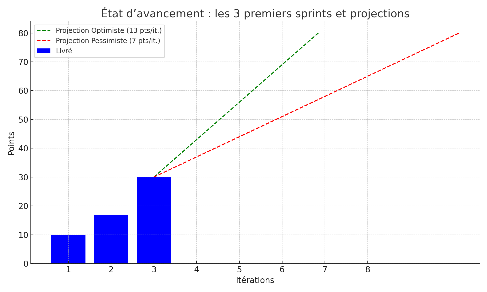

# Rapport de Suivi – Sprint 2

**Équipe :** Biblio_Teccart  
**Itération :** Sprint 2  
**But de l’itération :** L’utilisateur peut consulter un document, retourner un prêt, et payer une amende.  

---

### 🔢 Estimation en UP
**Total prévu :** 20 points utilisateurs

---

### 📊 Diagrammes UML
- Diagramme de cas d’utilisation : `docs/uml/use_case_diagram.png`
- Diagramme de classes : `docs/uml/class_diagram.png`

---

### 🧪 TDD / Tests unitaires
Prévu au Sprint 3.

---

### 🧩 Engagement

| Fonctionnalité                | Taille engagée | Taille réalisée | Statut       |
|------------------------------|----------------|------------------|--------------|
| Consultation document        | 7              | 7                | Terminé      |
| Retour d’un prêt             | 6              | 6                | Terminé      |
| Paiement d’une amende        | 7              | 6                | En cours     |
| **Total**                    | **20**         | **19**           |              |

---

### ⭐ Faits saillants
- L’API de paiement a été partiellement intégrée.
- Tests fonctionnels validés pour consultation et retour.

---

### 🌇 Sunset Graph

**Commentaires :**  
Selon notre vélocité, le projet sera terminé dans les temps.  
Petite baisse de productivité cette semaine à cause d’un souci d’accès à l’API externe.

---

### 📉 Coûts & Efforts

| État                      | Effort (h) | Coût ($) |
|---------------------------|------------|----------|
| Cumulatif Sprint 1        | 52         | 6240     |
| Sprint 2                  | 38         | 4560     |
| Total à date              | 90         | 10 800   |
| Estimation pour terminer  | 30         | 3600     |
| **Total prévu**           | 120        | 14 400   |
| **Budget initial**        | 120        | 14 400   |
| **Écart**                 | 0          | 0        |

---

### 🐞 Qualité
- Aucun bug critique signalé
- 3 améliorations mineures prévues au Sprint 3

---

### ⚠️ Risques & Obstacles
- Retard potentiel si Stripe reste instable (mitigation prévue avec fallback PayPal)

---

### 🔧 Plan d’amélioration
- Mieux tester le paiement sur sandbox
- Anticiper les dépendances API à l’avance
